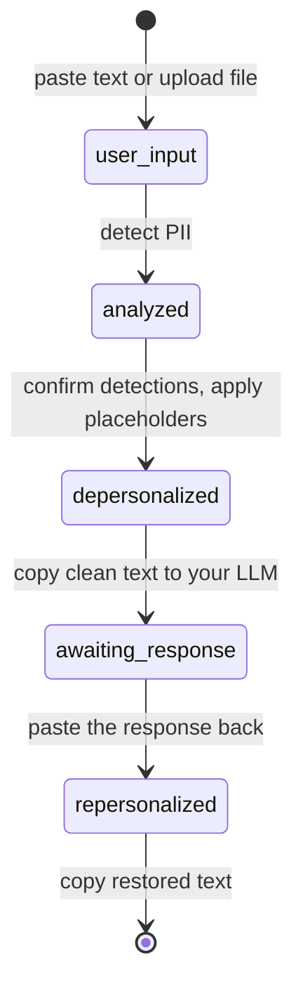
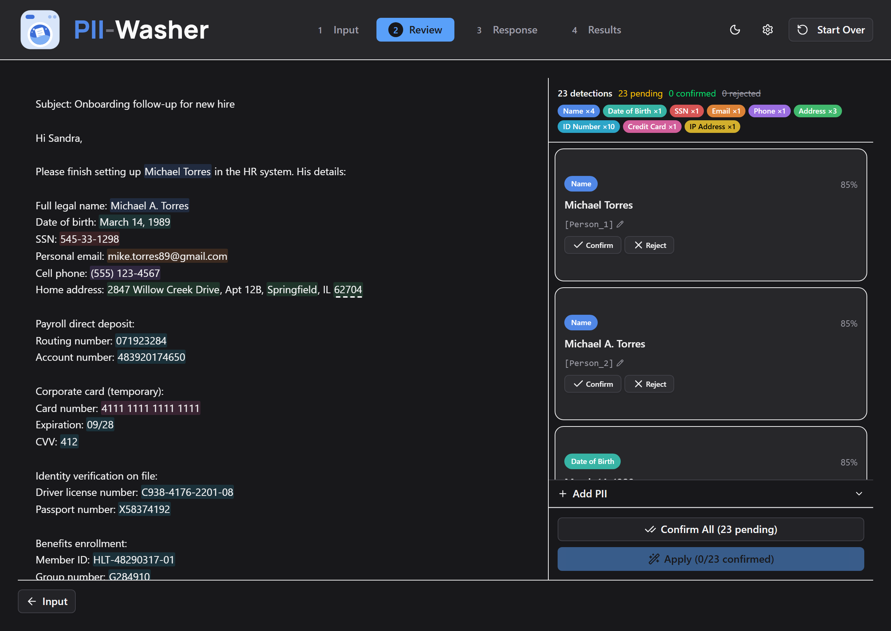
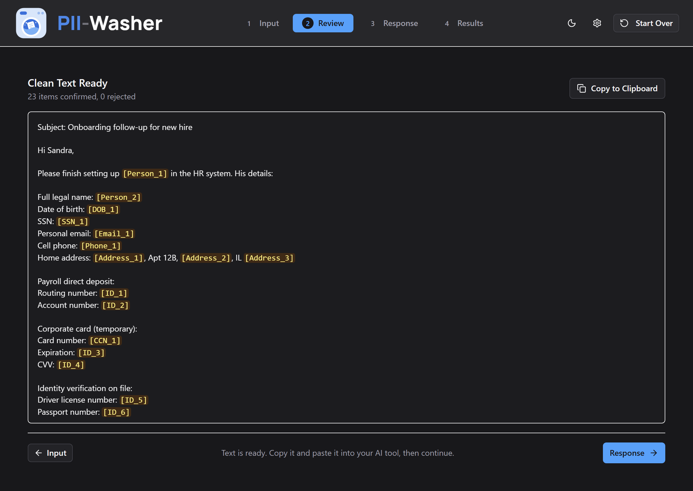
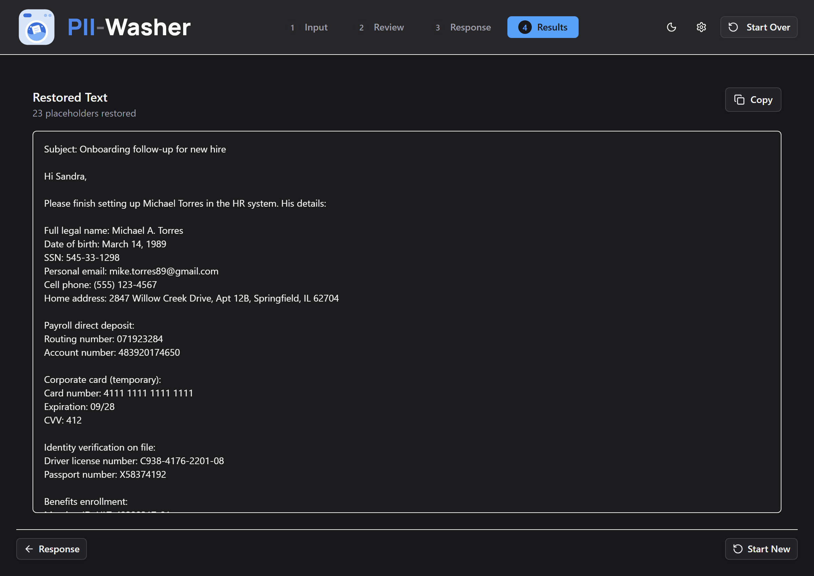

# PII-Washer

Local PII detection and text sanitization. Paste text containing personal data, get a clean version with all sensitive items replaced by consistent placeholders. Use the clean text with ChatGPT, Claude, or any other tool — then paste the response back and swap the placeholders for the originals.

> **Important:** PII detection is not perfect and will miss things. Detection is currently US/English-only — international formats (non-US phone numbers, national IDs from other countries, etc.) are not supported. This tool is designed to assist a human, not replace one. Always review the results before sending text anywhere. An "Add PII" feature is included so you can manually tag anything the detector missed.

## How it works

1. **Depersonalize** — Paste text (or upload a file) containing names, emails, phone numbers, addresses, and other PII. PII-Washer detects them and replaces each with a unique placeholder (e.g., `[PERSON_1]`, `[EMAIL_1]`). Placeholders are consistent within a session — the same name always gets the same placeholder.
2. **Work with clean text** — Copy the depersonalized version into any LLM or external tool. No real PII leaves your machine.
3. **Repersonalize** — Paste the response back. PII-Washer swaps the placeholders for the original values, giving you a fully restored document.

The workflow is a state machine — each step gates which operations are allowed:



**Review** — detections highlighted in place, with a sidebar to confirm, reject, or edit each one:



**Clean text** — every confirmed item replaced by a placeholder, ready to copy into your LLM:



**Results** — the response with placeholders swapped back for the original values:



### Supported file formats

| Format | Extensions |
|---|---|
| Plain text | .txt, .md |
| Documents | .docx, .pdf |
| Spreadsheets | .csv, .xlsx |
| Web pages | .html |

### Detected PII types

| Category | Examples |
|---|---|
| Person names | John Smith, Dr. Martinez |
| Email addresses | user@example.com |
| Phone numbers | (555) 123-4567, +1-555-123-4567 |
| Credit card numbers | Luhn-validated card numbers |
| Social Security numbers | 123-45-6789 |
| Dates of birth | Born on March 5, 1990 |
| IP addresses | 192.168.1.1 |
| Medical record numbers | MRN patterns |
| Locations | NER-detected entities |
| Labeled identifiers | Routing number: 071923284, Passport number: X58374192, License plate: WKM-4837, Employee ID: EMP-104928 |

Detection uses [Microsoft Presidio](https://microsoft.github.io/presidio/) with spaCy NER, plus custom regex recognizers for formats Presidio misses. Labeled identifiers (bank accounts, government IDs, insurance numbers, internal reference codes) are detected by their label — a bare code like `EMP-104928` floating in prose isn't detected, but `Employee ID: EMP-104928` is. Organization names (employers, banks) are **not** detected — use the manual "Add PII" feature for those.

## Privacy

PII-Washer is an offline desktop tool, designed to keep your data on your machine:

- **No network calls at runtime.** The UI uses system fonts, the detection model runs locally, and nothing is sent anywhere. The only download is the spaCy language model, once, at install time.
- **Session data lives in memory only** — documents and detected PII are never written to disk, and are cleared on reset or shutdown.
- **One file is written to disk:** a log at `~/.pii-washer/pii-washer.log` containing startup/shutdown events and error tracebacks. It never contains your document text or detected PII. Delete it whenever you like.

Honest limitations: this is a local tool built as a learning project, not an audited security product. It doesn't control what your OS does with clipboard history, and detection will miss some PII (see the note at the top). Review before you paste anywhere.

## Quick start

Runs from source on Windows. Requires **Python 3.11–3.13** and **Node.js 20.19+**. Python 3.14 is not supported — spaCy (the NLP library) is not yet compatible with it. See [INSTALL.md](INSTALL.md) for detailed instructions and troubleshooting.

```powershell
git clone https://github.com/romanmurray/pii-washer.git
cd pii-washer

# Backend
py -3.13 -m venv .venv
.venv\Scripts\activate
pip install -e .
pip install https://github.com/explosion/spacy-models/releases/download/en_core_web_lg-3.8.0/en_core_web_lg-3.8.0-py3-none-any.whl

# Frontend
cd pii-washer-ui
npm install
cd ..

# Run (two terminals)
uvicorn pii_washer.api.main:app --reload                 # Terminal 1: backend on :8000
cd pii-washer-ui ; npm run dev                            # Terminal 2: frontend on :5173
```

Open **http://localhost:5173** in your browser.

## Desktop app

PII-Washer also ships as a single-file Windows executable — FastAPI runs in a background thread and the UI opens in a native window (pywebview). To build it:

```powershell
pip install -e ".[desktop]" pyinstaller
cd pii-washer-ui ; npm run build ; cd ..

pyinstaller pyinstaller_entry.py --name pii-washer --windowed `
  --icon assets/app-icons/pii-washer-app-icon.ico `
  --add-data "pii-washer-ui/dist;ui" `
  --add-data "assets/app-icons/pii-washer-app-icon.ico;icon" `
  --add-data "pii_washer/data;pii_washer/data" `
  --collect-all en_core_web_lg `
  --collect-data tldextract `
  --collect-data presidio_analyzer `
  --hidden-import pii_washer.api.main `
  --hidden-import pii_washer.extractors.docx `
  --hidden-import pii_washer.extractors.pdf `
  --hidden-import pii_washer.extractors.csv_ext `
  --hidden-import pii_washer.extractors.xlsx `
  --hidden-import pii_washer.extractors.html

# Result: dist\pii-washer\pii-washer.exe
```

## Development

```powershell
pip install -e ".[dev]"        # dev deps: pytest, ruff, httpx
pytest                         # backend tests (fast — uses a mock detection engine)
pytest -m integration          # tests against the real Presidio/spaCy engine
ruff check .                   # backend lint

cd pii-washer-ui
npm run dev                    # frontend dev server
npm run test                   # frontend tests (vitest)
npm run lint                   # ESLint
npm run build                  # TypeScript check + production build
```

With the backend running, FastAPI serves interactive API documentation at **http://localhost:8000/docs**.

### Architecture

```
pii_washer/
  api/                        # FastAPI REST API (/api/v1/)
  document_loader.py          # Text/file ingestion and validation
  extractors/                 # .docx/.pdf/.csv/.xlsx/.html text extraction
  pii_detection_engine.py     # Presidio + spaCy NER + custom recognizers
  placeholder_generator.py    # Deterministic placeholder assignment ([TYPE_N])
  text_substitution_engine.py # Bidirectional text replacement
  session_manager.py          # Workflow orchestration — the single API boundary
  temp_data_store.py          # In-memory storage with secure clear
  tests/

pii-washer-ui/                # React 19 + TypeScript + Vite + Tailwind v4
pyinstaller_entry.py          # Desktop app entry point
```

All components are wired through `SessionManager`, which enforces the workflow state machine shown above. The React frontend talks to the FastAPI backend via `/api/v1/` endpoints.

## How this was built

PII-Washer is a learning project in AI-assisted development: the code was written by AI coding agents, directed, reviewed, and tested by a human. A few things about the process, visible in this repo:

- **[CLAUDE.md](CLAUDE.md)** is the actual instruction file used to direct the agents — architecture, constraints, and commands they need to work on the codebase.
- **[CHANGELOG.md](CHANGELOG.md)** is the project's history. It records not just additions but deliberate removals — a CI/release pipeline, an update checker, and multi-session management all shipped and were later cut when they didn't earn their keep.
- **[docs/adr/](docs/adr/)** holds decision records for choices where the tradeoffs were worth writing down.
- Review passes included adversarial reviews by a second AI model to catch what the primary agent missed.

## License

AGPL-3.0-or-later. See [LICENSE](LICENSE).

Copyright © 2026 Roman Murray
